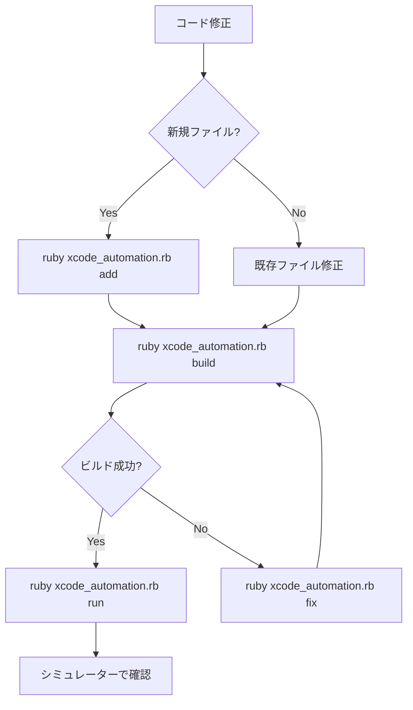

# 📱 Xcode自動化ガイド
## AIアシスタント用Xcodeプロジェクト管理手順書

---

## 🎯 目的
このガイドは、AIアシスタントがコード修正後に自動でXcodeプロジェクトに反映し、シミュレーターで実行するまでの完全な手順を提供します。

---

## 📋 前提条件

### 必要なツール
- **Xcode** (Beta版含む): `/Applications/Xcode-beta.app`
- **Ruby**: システムにインストール済み
- **xcodeproj gem**: `sudo gem install xcodeproj`
- **Command Line Tools**: `xcode-select --install`

### 環境設定確認
```bash
# Xcodeパスの確認
xcode-select -p
# 期待値: /Applications/Xcode-beta.app/Contents/Developer

# 必要に応じて設定
sudo xcode-select -s /Applications/Xcode-beta.app/Contents/Developer
```

---

## 🚀 クイックスタート

### 1️⃣ 新しいファイルを追加した後
```bash
cd /Users/apple/projects/morning-prompt-friend/MorningAssistant
ruby xcode_automation.rb add
```

### 2️⃣ ビルドエラーを修正した後
```bash
ruby xcode_automation.rb fix
```

### 3️⃣ すべてを自動実行
```bash
ruby xcode_automation.rb all
```

---

## 📝 詳細手順

### ステップ1: 新しいSwiftファイルの作成

**例: 新しいServiceを追加する場合**

1. ファイルを作成
```bash
# AIがwrite toolを使用
write_file path: "MorningAssistant/Services/NewService.swift"
```

2. Xcodeプロジェクトに自動追加
```bash
ruby xcode_automation.rb add
```

### ステップ2: ファイル構造の変更

**例: ファイルを移動する場合**

1. ファイルを移動
```bash
mv MorningAssistant/OldFile.swift MorningAssistant/Services/OldFile.swift
```

2. Xcodeプロジェクトのパスを修正
```bash
ruby xcode_automation.rb fix
```

### ステップ3: ビルドと実行

1. クリーンビルド
```bash
ruby xcode_automation.rb build
```

2. シミュレーターで実行
```bash
ruby xcode_automation.rb run
```

3. または一括実行
```bash
ruby xcode_automation.rb all
```

---

## 🔧 自動化スクリプトの機能

### `xcode_automation.rb` の各アクション

| アクション | コマンド | 説明 |
|-----------|---------|------|
| **add** | `ruby xcode_automation.rb add` | 新しいSwiftファイルを検出してXcodeプロジェクトに追加 |
| **fix** | `ruby xcode_automation.rb fix` | 重複削除とパス修正 |
| **build** | `ruby xcode_automation.rb build` | クリーンビルドを実行 |
| **run** | `ruby xcode_automation.rb run` | シミュレーターでアプリを起動 |
| **all** | `ruby xcode_automation.rb all` | すべてのステップを順番に実行 |

---

## 🤖 AI用チートシート

### 新規ファイル作成時
```bash
# 1. ファイルを作成（例：新しいViewModel）
write MorningAssistant/ViewModels/NewViewModel.swift

# 2. Xcodeプロジェクトに追加
run_terminal_cmd "cd MorningAssistant && ruby xcode_automation.rb add"
```

### 既存ファイル修正時
```bash
# 1. ファイルを修正
search_replace file: "MorningAssistant/Services/AlarmKitService.swift"

# 2. ビルドして確認
run_terminal_cmd "cd MorningAssistant && ruby xcode_automation.rb build"
```

### エラーが発生した場合
```bash
# 1. プロジェクトを修復
run_terminal_cmd "cd MorningAssistant && ruby xcode_automation.rb fix"

# 2. クリーンビルド
run_terminal_cmd "cd MorningAssistant && ruby xcode_automation.rb build"
```

### 完全なテストサイクル
```bash
# すべてを一度に実行
run_terminal_cmd "cd MorningAssistant && ruby xcode_automation.rb all"
```

---

## 🐛 トラブルシューティング

### よくあるエラーと対処法

#### 1. "cannot find 'ClassName' in scope"
**原因**: ファイルがXcodeプロジェクトに追加されていない
```bash
ruby xcode_automation.rb add
```

#### 2. "Multiple commands produce"
**原因**: 重複したファイル参照
```bash
ruby xcode_automation.rb fix
```

#### 3. "Build input files cannot be found"
**原因**: ファイルパスが間違っている
```bash
ruby xcode_automation.rb fix
```

#### 4. "Unable to boot device"
**原因**: シミュレーターが起動していない
```bash
xcrun simctl boot "iPhone 16 Pro"
open -a Simulator
```

---

## 📊 ワークフロー図



---

## 🔍 検証コマンド

### プロジェクト状態の確認
```bash
# ビルド可能か確認
xcodebuild -project MorningAssistant.xcodeproj -scheme MorningAssistant -destination "platform=iOS Simulator,name=iPhone 16 Pro" -showBuildSettings | grep VALID_ARCHS

# ファイルリストの確認
xcodebuild -project MorningAssistant.xcodeproj -list
```

### シミュレーター状態の確認
```bash
# 利用可能なシミュレーター
xcrun simctl list devices

# アプリの状態確認
xcrun simctl get_app_container "iPhone 16 Pro" com.morningassistant.app
```

---

## 💡 ベストプラクティス

1. **常にクリーンビルドから始める**
   ```bash
   ruby xcode_automation.rb clean
   ```

2. **ファイル追加は即座に反映**
   ```bash
   # ファイル作成後すぐに
   ruby xcode_automation.rb add
   ```

3. **エラーが出たらまず修復**
   ```bash
   ruby xcode_automation.rb fix
   ```

4. **定期的な完全チェック**
   ```bash
   ruby xcode_automation.rb all
   ```

---

## 📱 シミュレーター操作

### 基本操作
```bash
# 起動
xcrun simctl boot "iPhone 16 Pro"

# アプリインストール
xcrun simctl install "iPhone 16 Pro" ~/Library/Developer/Xcode/DerivedData/MorningAssistant-*/Build/Products/Debug-iphonesimulator/MorningAssistant.app

# アプリ起動
xcrun simctl launch "iPhone 16 Pro" com.morningassistant.app

# スクリーンショット
xcrun simctl io "iPhone 16 Pro" screenshot screenshot.png

# アプリ削除
xcrun simctl uninstall "iPhone 16 Pro" com.morningassistant.app

# シミュレーターリセット
xcrun simctl erase "iPhone 16 Pro"
```

---

## 📚 参考資料

- [Xcodeproj Documentation](https://www.rubydoc.info/gems/xcodeproj)
- [xcodebuild Manual](https://developer.apple.com/library/archive/technotes/tn2339/_index.html)
- [simctl Documentation](https://developer.apple.com/documentation/xcode/simctl)

---

## ✅ チェックリスト

AIがコード修正後に確認すべき項目：

- [ ] 新規ファイルを作成した場合、`ruby xcode_automation.rb add` を実行
- [ ] ファイルを移動/削除した場合、`ruby xcode_automation.rb fix` を実行
- [ ] ビルドエラーが出た場合、`ruby xcode_automation.rb fix` を実行
- [ ] ビルド成功後、`ruby xcode_automation.rb run` でシミュレーター起動
- [ ] アプリが正常に動作することを確認

---

**このガイドに従えば、AIアシスタントは自動的にXcodeプロジェクトを管理し、シミュレーターでアプリを実行できます。**
