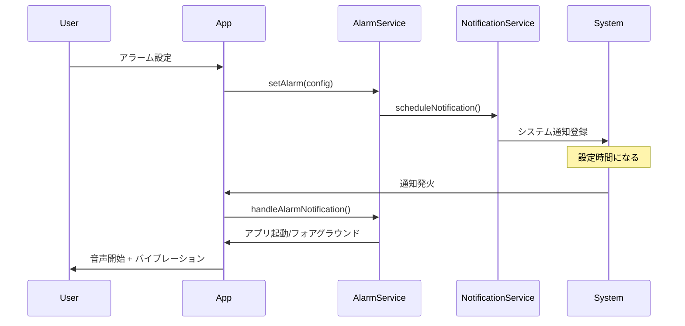
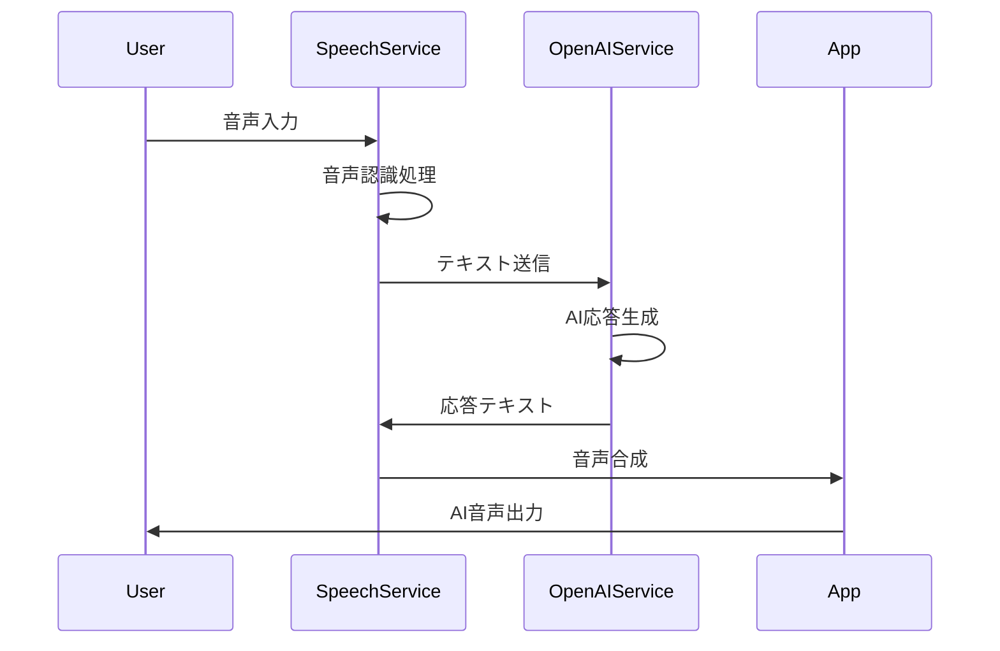

# 朝のAIアシスタント - システム設計書

## 📐 設計概要

### アーキテクチャパターン
**ハイブリッドPWA + Capacitorアーキテクチャ**
- PWAベースのWebアプリケーション
- Capacitorによるネイティブ機能拡張
- 段階的な開発・デプロイメント戦略

## 🏗️ システムアーキテクチャ

### レイヤー構成
```
┌─────────────────────────────────────┐
│         Presentation Layer          │
│    (React Components + UI)          │
├─────────────────────────────────────┤
│         Business Logic Layer        │
│    (Services + Hooks + State)       │
├─────────────────────────────────────┤
│         Platform Bridge Layer       │
│         (Capacitor Plugins)         │
├─────────────────────────────────────┤
│         External Services           │
│    (OpenAI API + Web APIs)          │
└─────────────────────────────────────┘
```

### 技術スタック詳細

#### Core Framework
```yaml
Base:
  - React: ^18.3.1
  - TypeScript: ^5.5.3
  - Vite: ^5.4.1

State Management:
  - React Query: ^5.56.2 (Server State)
  - React Hook Form: ^7.53.0 (Form State)
  - Zustand: 新規追加予定 (Client State)

UI Framework:
  - Tailwind CSS: ^3.4.11
  - shadcn/ui: 継続使用
  - NativeWind: PWA→Capacitor移行時に追加
```

#### PWA Extension
```yaml
PWA:
  - vite-plugin-pwa: ^0.17.0
  - Workbox: Service Worker管理

Manifest:
  - Web App Manifest: インストール対応
  - App Icons: 複数サイズ対応
```

#### Capacitor Integration
```yaml
Core:
  - @capacitor/core: ^6.0.0
  - @capacitor/cli: ^6.0.0

Platform:
  - @capacitor/ios: ^6.0.0
  - @capacitor/android: ^6.0.0 (後期追加)

Plugins:
  - @capacitor/speech: 音声機能
  - @capacitor/local-notifications: 通知機能
  - @capacitor/haptics: バイブレーション
  - @capacitor/preferences: ローカルストレージ
  - @capacitor/app: アプリライフサイクル
  - @capacitor/background-mode: バックグラウンド実行
```

## 📁 プロジェクト構成

### ディレクトリ構造
```
morning-prompt-friend-mobile/
├── src/
│   ├── components/              # UIコンポーネント
│   │   ├── ui/                 # shadcn/ui base components
│   │   ├── features/           # 機能別コンポーネント
│   │   │   ├── alarm/         # アラーム関連
│   │   │   ├── speech/        # 音声関連
│   │   │   ├── settings/      # 設定関連
│   │   │   └── logs/          # ログ関連
│   │   └── layout/            # レイアウトコンポーネント
│   ├── hooks/                  # カスタムフック
│   │   ├── useAlarm.ts
│   │   ├── useSpeech.ts
│   │   ├── useNotifications.ts
│   │   └── useCapacitor.ts
│   ├── services/               # ビジネスロジック
│   │   ├── speech/
│   │   │   ├── speechService.ts
│   │   │   └── capacitorSpeechService.ts
│   │   ├── alarm/
│   │   │   ├── alarmService.ts
│   │   │   └── notificationService.ts
│   │   ├── storage/
│   │   │   ├── storageService.ts
│   │   │   └── capacitorStorageService.ts
│   │   └── openai/
│   │       └── openaiService.ts
│   ├── stores/                 # 状態管理
│   │   ├── alarmStore.ts
│   │   ├── speechStore.ts
│   │   └── settingsStore.ts
│   ├── types/                  # 型定義
│   │   ├── alarm.ts
│   │   ├── speech.ts
│   │   └── capacitor.ts
│   ├── utils/                  # ユーティリティ
│   │   ├── platform.ts        # プラットフォーム判定
│   │   ├── audio.ts           # 音声関連ユーティリティ
│   │   └── time.ts            # 時間関連ユーティリティ
│   └── assets/                 # 静的リソース
│       ├── sounds/            # 音声ファイル
│       │   ├── gentle_alarm.wav
│       │   ├── energetic_alarm.wav
│       │   └── nature_alarm.wav
│       └── icons/             # アプリアイコン
├── public/                     # 公開リソース
│   ├── manifest.json          # PWA Manifest
│   ├── sw.js                  # Service Worker
│   └── icons/                 # PWA用アイコン
├── ios/                        # iOS Capacitor設定
├── android/                    # Android Capacitor設定
├── capacitor.config.ts         # Capacitor設定
└── docs/                       # ドキュメント
    ├── requirements.md
    ├── design.md
    └── deployment.md
```

## 🔧 主要コンポーネント設計

### 1. AlarmService - アラーム管理サービス

```typescript
interface AlarmConfig {
  id: string;
  time: string;           // "07:00"
  days: WeekDay[];        // ["monday", "tuesday", ...]
  soundType: AlarmSoundType;
  isEnabled: boolean;
  preNotification: boolean; // 5分前通知
  snoozeEnabled: boolean;
}

class AlarmService {
  // アラーム設定
  async setAlarm(config: AlarmConfig): Promise<void>
  
  // アラーム削除
  async removeAlarm(alarmId: string): Promise<void>
  
  // 段階的通知の実行
  private async schedulePersistentNotifications(config: AlarmConfig): Promise<void>
  
  // 通知音のテスト
  async testAlarmSound(soundType: AlarmSoundType): Promise<void>
}
```

### 2. CapacitorSpeechService - 音声機能サービス

```typescript
class CapacitorSpeechService implements ISpeechService {
  // 音声合成（Capacitor版）
  async speak(text: string, options?: SpeechOptions): Promise<void>
  
  // 音声認識（Capacitor版）
  async startListening(): Promise<string>
  
  // プラットフォーム判定による適応的動作
  private isCapacitorAvailable(): boolean
  
  // フォールバック（Web Speech API）
  private fallbackToWebSpeech(): void
}
```

### 3. NotificationService - 通知管理サービス

```typescript
class NotificationService {
  // 権限要求
  async requestPermissions(): Promise<boolean>
  
  // 即座の通知
  async sendNotification(notification: NotificationConfig): Promise<void>
  
  // スケジュール通知
  async scheduleNotification(notification: ScheduledNotification): Promise<void>
  
  // 通知履歴管理
  async getNotificationHistory(): Promise<NotificationRecord[]>
}
```

## 📊 データフロー設計

### アラーム通知フロー


### 音声対話フロー


## 🔄 状態管理設計

### Zustand Store構成

```typescript
// アラーム状態管理
interface AlarmStore {
  alarms: AlarmConfig[];
  activeAlarm: AlarmConfig | null;
  isAlarmRinging: boolean;
  
  // Actions
  addAlarm: (config: AlarmConfig) => void;
  updateAlarm: (id: string, updates: Partial<AlarmConfig>) => void;
  deleteAlarm: (id: string) => void;
  setActiveAlarm: (alarm: AlarmConfig | null) => void;
  setAlarmRinging: (isRinging: boolean) => void;
}

// 音声機能状態管理
interface SpeechStore {
  isListening: boolean;
  isSpeaking: boolean;
  currentMessage: string;
  conversationHistory: ConversationEntry[];
  
  // Actions
  setListening: (listening: boolean) => void;
  setSpeaking: (speaking: boolean) => void;
  addToHistory: (entry: ConversationEntry) => void;
  clearHistory: () => void;
}
```

## 📱 プラットフォーム適応設計

### Platform Detection
```typescript
class PlatformService {
  static isCapacitor(): boolean {
    return Capacitor.isNativePlatform();
  }
  
  static isPWA(): boolean {
    return window.matchMedia('(display-mode: standalone)').matches;
  }
  
  static isMobile(): boolean {
    return /Android|iPhone|iPad|iPod|BlackBerry|IEMobile|Opera Mini/i.test(navigator.userAgent);
  }
  
  static getOptimalAudioFormat(): 'wav' | 'mp3' | 'aac' {
    if (this.isCapacitor()) return 'wav';
    return 'mp3';
  }
}
```

### Adaptive Service Pattern
```typescript
// サービスファクトリーパターン
class ServiceFactory {
  static createSpeechService(): ISpeechService {
    if (PlatformService.isCapacitor()) {
      return new CapacitorSpeechService();
    }
    return new WebSpeechService();
  }
  
  static createStorageService(): IStorageService {
    if (PlatformService.isCapacitor()) {
      return new CapacitorStorageService();
    }
    return new WebStorageService();
  }
}
```

## 🎨 UI/UX設計原則

### Mobile-First Design
- **タッチターゲット**: 最小44px × 44px
- **レスポンシブブレークポイント**: 320px, 768px, 1024px
- **アニメーション**: 60fps対応、reduced-motion考慮

### アクセシビリティ
- **音声読み上げ**: VoiceOver/TalkBack対応
- **キーボードナビゲーション**: フォーカス管理
- **カラーコントラスト**: WCAG AA準拠

## 📈 パフォーマンス最適化

### Code Splitting
```typescript
// ルートベースのコード分割
const AlarmScreen = lazy(() => import('./screens/AlarmScreen'));
const SettingsScreen = lazy(() => import('./screens/SettingsScreen'));
const LogsScreen = lazy(() => import('./screens/LogsScreen'));
```

### リソース最適化
- **画像**: WebP対応、適応的サイズ
- **音声**: 圧縮最適化、プリロード戦略
- **フォント**: サブセット化、プリロード

### メモリ管理
- **音声データ**: 一時的保存、自動クリーンアップ
- **履歴データ**: LRUキャッシュによる制限
- **リスナー**: 適切なクリーンアップ処理

## 🚀 デプロイメント戦略

### 開発フェーズ
1. **Phase 1**: PWA化（ブラウザ動作確認）
2. **Phase 2**: Capacitor統合（基本機能）
3. **Phase 3**: iOS最適化（ネイティブ機能）
4. **Phase 4**: Android対応（時期後決定）

### ビルド・配布プロセス
```yaml
Development:
  - ブラウザ: `npm run dev`
  - PWA: `npm run build && npm run preview`

Capacitor:
  - iOS Build: `npm run build && npx cap copy ios && npx cap open ios`
  - Android Build: `npm run build && npx cap copy android && npx cap open android`

Production:
  - App Store: Xcode経由でビルド・配布
  - Google Play: Android Studio経由でビルド・配布
```

## 🧪 テスト戦略

### テストピラミッド
```
┌─────────────────────────┐
│      E2E Tests          │ ← Capacitor実機テスト
├─────────────────────────┤
│   Integration Tests     │ ← サービス間連携テスト  
├─────────────────────────┤
│     Unit Tests          │ ← コンポーネント・関数テスト
└─────────────────────────┘
```

### テストツール
- **Unit**: Vitest + React Testing Library
- **Integration**: MSW (API Mock)
- **E2E**: Playwright (PWA) + Appium (Native)

## 🔒 セキュリティ設計

### データ保護
- **APIキー**: Capacitor Preferences (encrypted)
- **音声データ**: メモリ内のみ、永続化なし
- **ユーザー設定**: ローカル暗号化ストレージ

### 権限管理
- **マイク**: 音声認識時のみ要求
- **通知**: アラーム設定時に要求
- **ストレージ**: 設定保存時に要求

この設計書に基づいて、次に設計図を作成いたします。 