# 朝のAIアシスタント - 開発・運用フロードキュメント

## 🔄 継続的な機能追加における開発フロー

### **重要な結論: 毎回全段階を通る必要はありません！**

初回構築（PWA + Capacitor環境）完了後は、機能の種類に応じて効率的な開発フローを選択できます。

## 📊 機能追加パターン別フロー

### 🟢 **簡単な機能追加（80%のケース）**

#### **対象機能:**
- 新しいUI機能・画面追加
- 設定項目の追加・変更
- 表示内容・文言の変更
- 既存音声メッセージの更新
- ログ機能の拡張
- スタイル・デザインの調整

#### **開発フロー（所要時間: 10分〜数時間）:**

```mermaid
graph LR
    A[ブラウザで開発・テスト] --> B[PWAで動作確認]
    B --> C[実機で最終確認]
    
    style A fill:#e8f5e8
    style B fill:#fff3e0
    style C fill:#e1f5fe
```


```bash
# 実際の作業手順
1. ブラウザで開発・テスト ✅ (数分〜数時間)
   npm run dev

2. PWAで動作確認 ✅ (1分)
   npm run build && npm run preview

3. 実機で最終確認 ✅ (5分)
   # Capacitor再ビルド不要！
   # アプリを更新するだけで反映
```

**なぜ効率的？**
- **Hot Reload対応**: コード変更が即座に実機に反映
- **再ビルド不要**: Capacitorの再構築が不要
- **リアルタイム確認**: ブラウザDevToolsがそのまま使用可能

### 🟡 **中程度の機能追加（15%のケース）**

#### **対象機能:**
- 新しい音声ファイルの追加
- ストレージ機能の変更
- 既存Capacitorプラグインの設定変更
- 新しいフォーム・入力機能
- 画像・アセットの追加

#### **開発フロー（所要時間: 30分〜数時間）:**

```mermaid
graph LR
    A[ブラウザで開発・テスト] --> B[PWAで確認]
    B --> C[Capacitorビルド]
    C --> D[実機で確認]
    
    style A fill:#e8f5e8
    style B fill:#fff3e0
    style C fill:#ffe0b2
    style D fill:#e1f5fe
```


```bash
# 実際の作業手順
1. ブラウザで開発・テスト ✅
   npm run dev

2. PWAで確認 ✅
   npm run build && npm run preview

3. Capacitorビルド ✅ (2-3分)
   npx cap copy ios

4. 実機で確認 ✅
   # アプリ再起動で新しいアセットが反映
```

### 🔴 **複雑な機能追加（5%のケース）**

#### **対象機能:**
- 新しいCapacitorプラグインの追加
- カメラ・ファイル機能の実装
- プッシュ通知機能の追加
- バックグラウンド処理の追加
- ネイティブ機能の大幅変更

#### **開発フロー（所要時間: 半日〜数日）:**

```mermaid
graph LR
    A[ブラウザで開発・テスト] --> B[新プラグイン統合]
    B --> C[PWAで基本確認]
    C --> D[Capacitorビルド・設定]
    D --> E[実機で詳細テスト]
    
    style A fill:#e8f5e8
    style B fill:#ffcdd2
    style C fill:#fff3e0
    style D fill:#ffe0b2
    style E fill:#e1f5fe
```


```bash
# 実際の作業手順
1. ブラウザでモック実装・テスト ✅
   npm run dev

2. 新しいプラグインの統合 ✅
   npm install @capacitor/[new-plugin]
   # capacitor.config.ts 更新

3. PWAで基本確認 ✅
   npm run build && npm run preview

4. Capacitorビルド・設定 ✅
   npx cap copy ios
   npx cap open ios
   # Xcode設定変更が必要な場合あり

5. 実機で詳細テスト ✅
   # 新機能の権限要求・動作確認
```

## 🔧 効率化のための技術実装

### **プラットフォーム判定による開発効率化:**

```typescript
// utils/developmentUtils.ts
const isDevelopment = import.meta.env.DEV;
const isCapacitor = Capacitor.isNativePlatform();

export class DevelopmentUtils {
  // 開発時のモック機能
  static createMockService<T>(realService: T, mockImplementation: Partial<T>): T {
    if (isDevelopment && !isCapacitor) {
      return { ...realService, ...mockImplementation };
    }
    return realService;
  }

  // 開発時のログ出力
  static devLog(message: string, data?: any) {
    if (isDevelopment) {
      console.log(`[DEV] ${message}`, data);
    }
  }
}

// 使用例: 通知サービス
const notificationService = DevelopmentUtils.createMockService(
  new CapacitorNotificationService(),
  {
    // ブラウザ開発時はコンソール出力のみ
    scheduleNotification: (config) => {
      console.log('Mock通知:', config);
      return Promise.resolve();
    }
  }
);
```

### **Hot Reload環境の設定:**

```typescript
// capacitor.config.ts
import { CapacitorConfig } from '@capacitor/cli';

const config: CapacitorConfig = {
  appId: 'com.morningai.assistant',
  appName: '朝のAIアシスタント',
  webDir: 'dist',
  server: {
    // 開発時はローカルサーバーを指定
    url: process.env.NODE_ENV === 'development' 
      ? 'http://localhost:5173' 
      : undefined,
    cleartext: true
  }
};

export default config;
```

この設定により、**コード変更が実機にも即座に反映**されます。

### **環境別設定管理:**

```typescript
// .env.development
VITE_APP_ENV=development
VITE_MOCK_NOTIFICATIONS=true
VITE_MOCK_SPEECH=false
VITE_API_BASE_URL=http://localhost:5173

// .env.production
VITE_APP_ENV=production
VITE_MOCK_NOTIFICATIONS=false
VITE_MOCK_SPEECH=false
VITE_API_BASE_URL=

// 使用例
const config = {
  mockNotifications: import.meta.env.VITE_MOCK_NOTIFICATIONS === 'true',
  mockSpeech: import.meta.env.VITE_MOCK_SPEECH === 'true'
};
```

## 📱 実機テスト環境の構築

### **必要な環境・コスト:**

```yaml
ハードウェア要件:
  Mac: macOSが必要（代替手段あり）
  iPhone: iOS実機テスト用（開発者の既存デバイスでOK）

ソフトウェア要件:
  Xcode: 無料（App Storeからダウンロード）
  Apple Developer Account: $99/年

代替環境:
  MacinCloud: $30/月（推奨）
  AWS EC2 Mac: $25-40/月
  GitHub Actions: 従量課金
```

### **MacinCloud使用時の詳細手順:**

#### **Step 1: 環境契約・セットアップ（初回のみ1-2時間）**

```bash
# 1. MacinCloud契約
1. https://www.macincloud.com/ でアカウント作成
2. Server Plan選択（$30/月、最安プランでOK）
3. 即座に利用開始可能

# 2. VNC接続設定
4. MacinCloudから接続情報を取得
5. VNCクライアント設定（Windows用：RealVNC等）
6. リモートMacに接続

# 3. 開発環境構築
7. Xcode インストール（App Storeから、約1時間）
8. Apple Developer Account 設定
9. Git設定・ソースコード取得
```

#### **Step 2: Apple Developer Account設定（初回のみ30分）**

```bash
# 1. Apple Developer Program登録
- https://developer.apple.com/programs/
- 個人: $99/年、法人: $99/年
- 審査: 24-48時間

# 2. Xcode設定
- Xcode > Preferences > Accounts
- Apple ID追加・チーム選択
- 証明書自動管理設定
```

#### **Step 3: プロジェクト設定（初回のみ30分）**

```bash
# MacinCloud上で実行
git clone [your-repository]
cd morning-prompt-friend-mobile

npm install
npm run build
npx cap copy ios
npx cap open ios

# Xcode設定
# 1. Bundle Identifierを一意に設定
# 2. Development Teamを自分のアカウントに設定
# 3. Signing & Capabilitiesで自動管理有効化
```

#### **Step 4: 実機テスト（日常的に5分）**

```bash
# iPhone実機をMacに接続（物理的にはUSBケーブル）
# ※MacinCloudの場合は、ローカルiPhoneは直接接続不可

# 代替手段：
1. iOSシミュレータでのテスト（MacinCloud上）
2. TestFlightでの配布テスト（App Store Connect経由）
3. Ad Hoc配布での実機テスト
```

### **日常的な開発・テストフロー:**

```bash
# 効率的な日常フロー（15分サイクル）

PC側（メイン開発）:
├── コード編集・機能追加 (10分)
├── ローカルブラウザテスト (2分)
├── Git commit & push (1分)

MacinCloud側（実機確認）:
├── Git pull (30秒)
├── npm run build (30秒)
├── npx cap copy ios (30秒)
├── iOS実機・シミュレータテスト (2分)

合計時間: 約15分/サイクル
```

### **トラブルシューティング:**

#### **よくある問題と解決法:**

```yaml
証明書エラー:
  問題: "Code signing error"
  解決: Xcode > Preferences > Accounts で再ログイン

Bundle ID重複:
  問題: "Bundle identifier already exists"
  解決: Bundle Identifierを一意の名前に変更
  例: com.yourname.morningai.unique

デバイス認識されない:
  問題: iPhone実機が認識されない
  解決: iPhone設定で「このコンピュータを信頼する」

ビルドエラー:
  問題: Xcode build failed
  解決: Clean Build Folder (Cmd+Shift+K) → 再ビルド

MacinCloud接続不安定:
  問題: VNC接続が切れる
  解決: 
    - より安定したネット環境の使用
    - VNCクライアントの再接続設定
    - 作業時間の調整（深夜帯は安定）
```

## 🚀 運用時の効率化Tips

### **1. 開発環境の自動化:**

```bash
# 開発開始スクリプト
#!/bin/bash
echo "🚀 朝のAIアシスタント開発開始"

# ローカル開発サーバー起動
npm run dev &
DEV_PID=$!

# ブラウザ自動起動
sleep 3
open http://localhost:5173

echo "✅ 開発環境準備完了"
echo "開発サーバーPID: $DEV_PID"
```

```bash
# iOS実機テストスクリプト
#!/bin/bash
echo "📱 iOS実機テスト開始"

npm run build
npx cap copy ios

echo "✅ iOS準備完了。Xcodeで▶️ボタンを押してください"
```

### **2. デバッグ環境の最適化:**

```typescript
// 実機デバッグ用の設定
const debugConfig = {
  // Safari Remote Debuggingを有効化
  enableRemoteDebugging: true,
  
  // 実機上でのコンソールログ表示
  showConsoleOnDevice: import.meta.env.DEV,
  
  // エラーの詳細表示
  verboseErrors: import.meta.env.DEV
};

// 実機上でのデバッグ情報表示
if (debugConfig.showConsoleOnDevice) {
  // 画面上にログ表示するコンポーネント
  const DebugConsole = () => (
    <div className="fixed bottom-0 left-0 bg-black text-white text-xs p-2 z-50">
      {/* デバッグ情報 */}
    </div>
  );
}
```

### **3. バージョン管理の最適化:**

```bash
# 機能ブランチでの開発推奨
git checkout -b feature/new-alarm-sound
# 開発・テスト
git commit -m "feat: add new gentle alarm sound"
git push origin feature/new-alarm-sound

# メインブランチにマージ後、自動デプロイ
git checkout main
git merge feature/new-alarm-sound
# 自動的にApp Store Connect にビルド送信
```

## 📊 パフォーマンス監視

### **継続的なパフォーマンス測定:**

```typescript
// パフォーマンス測定ユーティリティ
class PerformanceMonitor {
  static measureStartupTime() {
    const startTime = performance.now();
    
    return {
      end: () => {
        const endTime = performance.now();
        const duration = endTime - startTime;
        console.log(`アプリ起動時間: ${duration.toFixed(2)}ms`);
        
        // 3秒を超える場合は警告
        if (duration > 3000) {
          console.warn('⚠️ 起動時間が目標値を超えています');
        }
        
        return duration;
      }
    };
  }
  
  static measureMemoryUsage() {
    if ('memory' in performance) {
      const memory = (performance as any).memory;
      console.log('メモリ使用量:', {
        used: Math.round(memory.usedJSHeapSize / 1024 / 1024) + 'MB',
        total: Math.round(memory.totalJSHeapSize / 1024 / 1024) + 'MB',
        limit: Math.round(memory.jsHeapSizeLimit / 1024 / 1024) + 'MB'
      });
    }
  }
}

// アプリ起動時の測定
const startup = PerformanceMonitor.measureStartupTime();
// アプリ初期化完了時
startup.end();
```

## 📋 まとめ

### **継続開発時の効率化ポイント:**

```markdown
✅ 機能に応じた適切な開発フローの選択
✅ Hot Reloadによる高速な開発サイクル
✅ MacinCloudによる効率的なiOS開発
✅ 自動化スクリプトによる作業時間短縮
✅ 継続的なパフォーマンス監視

🎯 結果:
- 通常の機能追加: 15分〜数時間
- 複雑な機能追加: 半日〜数日
- 実機テスト: 5分/回
- リリースサイクル: 週次〜月次で新機能追加可能
```

この開発フローにより、**初回構築後は非常に効率的な継続開発**が可能となり、ユーザーの要望に迅速に対応できます。 

## 補足

## 次回作業時の手順

```bash
# 1. 最新コード取得
git pull origin mobile-app

# 2. 依存関係更新
npm install

# 3. ビルド・同期
npm run build
npx cap sync ios

# 4. Xcode起動・実機テスト
npx cap open ios
```